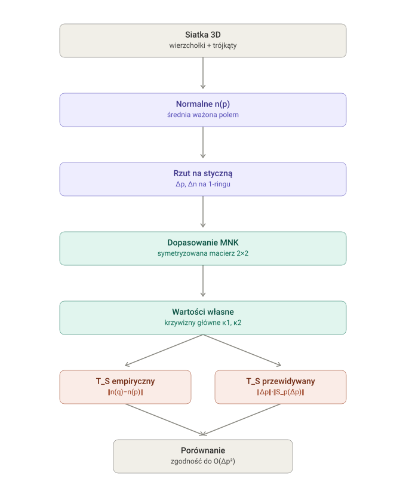
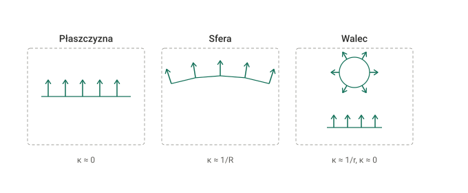

# TIMDR-Geometry-Formalism

Numeryczna implementacja Aksjomatów G8-G9 gałęzi geometrycznej TIMDR:
dyskretny operator kształtu (Weingarten) na trójkątnej siatce 3D,
domykający numerycznie związek skrętu powierzchniowego z krzywizną,
nazwany w [`Axioms_G_TIMDR_Geometry.md`](../GIA-TIMDR/docs/theory/Axioms_G_TIMDR_Geometry.md)
(Aksjomat G4) i domknięty tam analitycznie (Aksjomaty G8-G9).

Analogiczny cel jak `TIMDR-Math-Formalism` dla gałęzi sygnałowej: teoria
żyje w GIA-TIMDR, tu żyje działający, testowalny kod, który ją
implementuje — nie osobna, konkurencyjna definicja.





## Co to liczy

Dla wierzchołka `p` trójkątnej siatki `S⊂ℝ³`:

1. Normalną wierzchołkową `n(p)` (średnia normalnych sąsiednich
   trójkątów, ważona polem).
2. Dyskretny operator kształtu `S_p: ℝ³→ℝ³` (a właściwie
   `T_pS→T_pS`) metodą najmniejszych kwadratów na 1-ringu sąsiadów —
   Aksjomat G9b.
3. Krzywizny główne `κ1, κ2` jako wartości własne `S_p` (po
   symetryzacji), krzywiznę średnią `H` i Gaussa `K`.
4. Skręt powierzchniowy `T_S(p)` dwoma sposobami: bezpośrednio z
   Aksjomatu G3 (`‖n(p+Δp)−n(p)‖`, funkcja `T_S_empirical`) i
   przewidziany z operatora kształtu wg Aksjomatu G9c
   (`‖Δp‖·‖S_p(Δ̂p)‖`, funkcja `T_S_predicted`) — do porównania.

**Konwencja znaku:** `S_p := -D_v n(p)` (Aksjomat G9a). Dla wypukłej
powierzchni z normalną na zewnątrz (np. sfera) to daje **ujemne**
wartości własne. Jedyne użycie tego operatora gdzie indziej w
formalizmie (Aksjomat G8d, ograniczenie Lipschitza) zależy tylko od
`κ_max = max(|κ1|,|κ2|)` — moduł i jego testy sprawdzają magnitudy, nie
znak.

## 🔧 Instalacja

```
pip install -r requirements.txt
```

Wymaga tylko `numpy` (Python 3.9+).

## 🚀 Szybki start

```python
from timdr_geometry import make_sphere_mesh, vertex_normals, one_ring, discrete_shape_operator, kappa_max

mesh = make_sphere_mesh(n_lat=24, n_lon=24, radius=2.0)
normals = vertex_normals(mesh)
rings = one_ring(mesh)

op = discrete_shape_operator(mesh, normals, point_idx=100, rings=rings)
print(op.principal_curvatures)   # oczekiwane: ~[-0.5, -0.5] (1/radius, ze znakiem -Dn)
print(kappa_max(op))             # ~0.5 — stała Lipschitza z Aksjomatu G8d
```

## 🧪 Testy

```
pip install pytest
pytest tests/ -v
```

Cztery testy stabilności — dokładnie te, których brakowało wg Aksjomatu
G7c — na przypadkach znanych analitycznie:

| Test | Siatka | Oczekiwany wynik |
|---|---|---|
| `TestPlane` | płaszczyzna | `S_p≡0`, `T_S≡0` wszędzie |
| `TestSphere` | sfera promienia R | obie krzywizny główne `≈1/R`, `K=κ1κ2≈1/R²>0` |
| `TestCylinder` | walec promienia r | jedna krzywizna `≈0` (oś), druga `≈1/r` (obwód) |
| `TestMeshRefinement` | sfera, rosnąca rozdzielczość | błąd krzywizny i błąd `T_S_predicted` vs `T_S_empirical` maleją przy zagęszczaniu siatki |

**✅ Zweryfikowane.** `pytest tests/ -v` — 17/17 testów przeszło
(w tym te cztery testy stabilności Weingartena).

## 🌀 Kongruencja Γ(t,s) dla chronoprocesu — `timdr_geometry.chronocongruence`

Odpowiedź na wcześniej otwarty błąd obiektu: pojedyncza trajektoria
"czasu" jest krzywą 1D i nie ma operatora kształtu. Potrzeba rodziny
trajektorii `{γ_s}_{s∈I}`, `Γ(t,s)=γ_s(t)`, tak żeby obraz
`S=Γ(T×I)⊂ℝ³` był prawdziwą powierzchnią 2D — wtedy `n(p)`, `S_p`,
`T_S(p)` z tego repo działają dosłownie, bez metafory. Patrz
`GIA-TIMDR/SKILL_timdr-signal-framework.md` za pełne uzasadnienie tej
konstrukcji (Chronoproces `Ξ=(T,x,Γ,φ)`).

`make_congruence_mesh(gamma, t_values, s_values, t_periodic, s_periodic)`
buduje siatkę z DOWOLNEJ funkcji `gamma(t,s)→(x,y,z)` — generalizacja
wzorca już użytego w `make_plane_mesh`/`make_sphere_mesh`/
`make_cylinder_mesh` (te trzy NIE zostały przepisane na to wywołanie,
ale są jego szczególnymi przypadkami — sprawdzone testem równoważności
w `tests/test_chronocongruence.py`, dającym identyczne wierzchołki i
trójkąty).

Trzy kanoniczne kongruencje o znanej analitycznie krzywiźnie:

| Kongruencja | Sens | Krzywizna wzdłuż t | Krzywizna wzdłuż s |
|---|---|---|---|
| `flat_parallel_congruence` | trajektorie równoległe, bez zbiegania/rozbiegania | 0 | 0 |
| `cylindrical_congruence` | trajektorie ułożone po okręgu, biegnące wzdłuż wspólnej osi | ≈0 (osiowo) | ≈1/r (obwodowo) |
| `spherical_congruence` | trajektorie zbiegające się symetrycznie ku "biegunom" | ≈1/R | ≈1/R (izotropowo) |

```python
from timdr_geometry import make_congruence_mesh, cylindrical_congruence, vertex_normals, discrete_shape_operator, one_ring

zs = [0.0, 1.0, 2.0, 3.0]
thetas = [i * (2 * 3.14159265 / 12) for i in range(12)]
mesh = make_congruence_mesh(
    lambda t, s: cylindrical_congruence(t, s, radius=1.5),
    t_values=zs, s_values=thetas, t_periodic=False, s_periodic=True,
)
normals = vertex_normals(mesh)
rings = one_ring(mesh)
op = discrete_shape_operator(mesh, normals, point_idx=13, rings=rings)
print(op.principal_curvatures)  # oczekiwane co do WARTOSCI BEZWZGLEDNEJ: jedna ~0 (osiowo), druga ~0.667=1/1.5 (obwodowo) — konkretny znak/kolejnosc zaleza od konwencji S_p=-D_v n, patrz uwaga na gorze weingarten.py
```

**⚠️ Granica zakresu, jawnie.** Ten moduł mierzy krzywiznę ZEWNĘTRZNĄ
(Weingarten/T_S) powierzchni zamiecionej przez `Γ(t,s)`. NIE
implementuje rozkładu ekspansja/ścinanie/skręt (θ/σ/ω) kongruencji
geodezyjnych z równania Raychaudhuriego (OTW) — to była wskazana
ANALOGIA uzasadniająca, że `T_S` na takiej powierzchni jest sensownym
obiektem geometrycznym, nie twierdzenie o równoważności z którąś z
tamtych trzech wielkości. Domena `I` (co dokładnie parametryzuje
"sąsiednie" trajektorie) pozostaje decyzją modelową — trzy przykłady
powyżej to konkretne ilustracje, nie jedyny "poprawny" wybór.

**✅ Zweryfikowane.** `pytest tests/ -v` — 17/17 testów przeszło,
w tym oba typu testów `test_chronocongruence.py` (równoważność z
`make_plane/cylinder/sphere_mesh` i bezpośrednia krzywizna).

## 📐 Obwiednia zaokrąglona ∂_R(Δ) i parametr (P,Q) — `timdr_geometry.envelope`

Numeryczna implementacja Aksjomatu G10 (`Axioms_G_TIMDR_Geometry.md`) —
inny obiekt niż G8-G9: krzywizna **krzywej** (obwiedni trójkąta), nie
**powierzchni**. `P=L0/L`, `Q=Lk/L=1-P` — udział prostoliniowej vs
łukowej części obwiedni zaokrąglonego trójkąta, jako funkcja promienia
zaokrąglenia `R`.

**Poprawka błędu znalezionego w tej samej sesji.** Pierwsza wersja
Aksjomatu G10e twierdziła, że złamanie symetrii trójkąta ściśle
ogranicza zasięg `Q` (tylko trójkąt równoboczny miał osiągać `Q=1`).
To było matematycznie fałszywe — wyszło na jaw przy liczeniu
konkretnego przykładu liczbowego (nie przy przeglądzie aksjomatu).
Poprawiona wersja: `R_max(Δ)=r_in(Δ)` **dokładnie dla każdego
trójkąta** (standardowa tożsamość stycznej-do-okręgu-wpisanego), więc
`Q=1` jest osiągalne zawsze. `tests/test_envelope.py` weryfikuje to
numerycznie na 5 trójkątach (ostry, prostokątny, rozwarty, prawie
zdegenerowany, równoboczny), licząc `R_max` i `r_in` DWIEMA
NIEZALEŻNYMI ścieżkami (suma kotangensów połówek kątów vs wzór Herona),
żeby test nie był kołowy.

```python
from timdr_geometry import TriangleGeometry, P_of_R, Q_of_R, R_of_P, verify_envelope_length

tri = TriangleGeometry.from_sides(3.0, 4.0, 5.0)   # jawnie asymetryczny
print(tri.R_max(), tri.r_in)          # 1.0, 1.0 — równe, poprawka G10e
print(P_of_R(tri, 0.4), Q_of_R(tri, 0.4))   # (0.7412, 0.2588)
print(R_of_P(tri, 0.5))               # "i odwrotnie" (G10d): zadany P -> R

# niezależna weryfikacja numeryczna: skonstruowana polilinia vs wzór zamknięty
result = verify_envelope_length([0,0], [4,0], [0,3], R=0.5, n_arc=300)
print(result["relative_error"])       # << 1
```

**Co jest sprawdzone testami (`tests/test_envelope.py`):** `R_max(Δ)=r_in(Δ)`
i `c(Δ)=s/r_in(Δ)` na 5 trójkątach; `L0(R_max)=0` i `Q(R_max)=1` dla
każdego z nich (poprawka G10e); nierówność Jensena `c(Δ)≥3√3` z
równością tylko dla równobocznego (G10d); ścisła monotoniczność `P(R)`
i odwracalność `R_of_P(P_of_R(R))=R` (G10d, "i odwrotnie"); niezależna
zgodność skonstruowanej obwiedni (odcinki+łuki, próbkowane numerycznie)
z zamkniętym wzorem `L(R)` (ten sam duch co `T_S_empirical` vs
`T_S_predicted` w `weingarten.py`); przypadki błędne (`R>R_max`,
zdegenerowany trójkąt, punkty 3D podane do konstrukcji płaskiej).

**✅ Zweryfikowane.** `pytest tests/test_envelope.py -v` — **65/65
testów przeszło** (poprawka G10e na 5 trójkątach, monotoniczność i
odwracalność P(R), niezależna weryfikacja skonstruowanej geometrii
przeciwko wzorowi zamkniętemu, przypadki błędne).

## ⚠️ Czego to NIE robi (status wg Aksjomatu G7)

Ten moduł domyka **numerycznie** to, co Aksjomaty G8-G9 domknęły
**analitycznie** — implementację operatora kształtu na konkretnej
siatce. To NIE zamyka całego Aksjomatu G7c:

- **(1) pełna definicja `W_S`** — częściowo domknięte (różniczkowa +
  dyskretna wersja tutaj).
- **(2) formalna przestrzeń powierzchni** — wciąż otwarte, ten moduł
  operuje na konkretnych siatkach, nie na przestrzeni wszystkich
  dopuszczalnych powierzchni.
- **(3) testy empiryczne** — testy tego repo są na siatkach
  SYNTETYCZNYCH o znanej analitycznie odpowiedzi (płaszczyzna/sfera/
  walec), nie na rzeczywistych danych geometrycznych (skan 3D, dane
  pomiarowe) — w odróżnieniu od gałęzi M/S, gdzie
  `TIMDR-Math-Formalism/docs/REAL_DATA_VALIDATION.md` dokumentuje test
  na realnych danych. Odpowiednika tego dla gałęzi G nie ma.
- **(4) niezależna walidacja** — wciąż otwarte.

Gałąź geometryczna pozostaje **koncepcyjna** (Aksjomat G7a) mimo tego
modułu — ten kod jest jednym z czterech wymaganych kroków, nie
wszystkimi czterema.

## 📄 Licencja

MIT — patrz [LICENSE](LICENSE).
